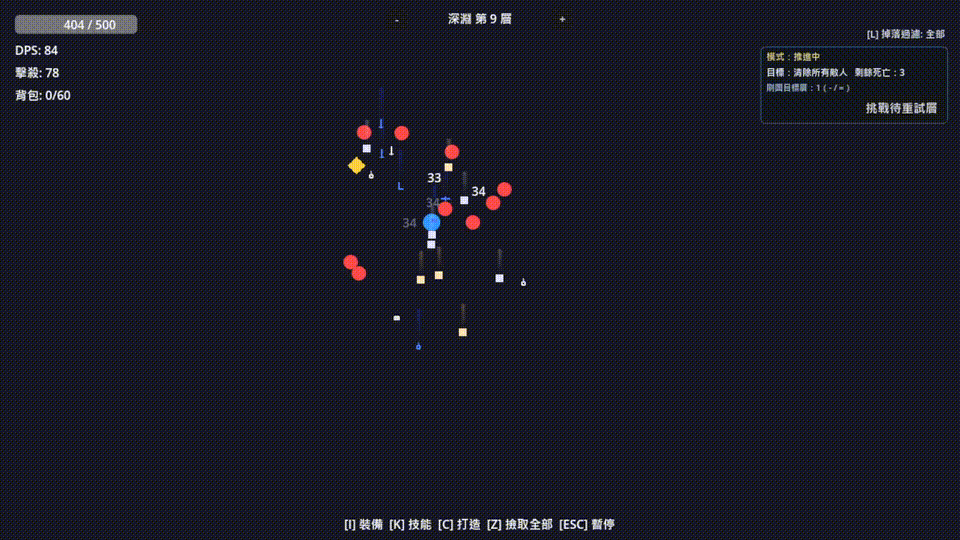
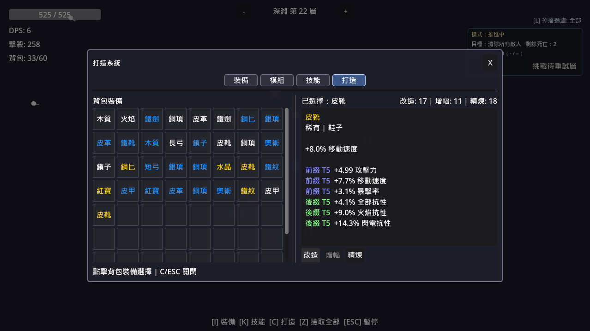

# abyssal-walker

[English](README.md) | [繁體中文](README.zh-TW.md)

`abyssal-walker` is a 2D Action RPG prototype built with Godot 4.

This project focuses on fast combat, abyss floor progression, and build crafting through loot, affixes, gems, and modules.

## Gameplay Preview

  

## Screenshots

  
  
  

## Game Overview

You control an auto-attacking hero that pushes deeper floors in the abyss.
Each run is about:

1. Clearing enemies and floor objectives
2. Picking up loot and upgrade resources
3. Improving your build through equipment, gems, modules, and crafting
4. Pushing further, or farming selected floors when progress stalls

## Core Features

- Abyss progression with floor objectives and boss milestone floors
- Push/Farm/Retry flow when a floor fails repeatedly
- Data-driven enemy, item, affix, gem, module, and floor configs (`data/*.json`)
- Equipment system with rarity, prefix/suffix affixes, and inventory management
- Skill Gem + Support Gem link system with modifiers (projectiles, chain, pierce, area, etc.)
- Module board system with load cost and stat-oriented build choices
- Crafting materials and item crafting actions (`alter`, `augment`, `refine`)
- Status effects (`burn`, `freeze`, `shock`, `bleed`) and combat feedback
- HUD with DPS, kills, loot filter, progression status, and pickup feed

## Current Content Snapshot

- Main playable scene: `scenes/main/game.tscn`
- Systems:
  - Combat, projectiles, melee/ranged skill handling
  - Enemy spawning and wave/floor loop
  - Loot drop and pickup
  - Equipment panel
  - Skill link panel
  - Crafting panel
  - Module panel

## Controls

- `I`: Equipment panel
- `K`: Skill Link panel
- `C`: Crafting panel
- `M`: Module panel
- `Z`: Pickup nearby items
- `L`: Cycle loot filter
- `-` / `=`: Decrease/Increase current farm floor
- `N`: Challenge pending failed floor
- `Esc` (pause action): Pause/Resume

## Project Structure

- `scenes/main/game.tscn`: main scene
- `scripts/main`: game flow and floor progression
- `scripts/entities`: player, enemy, projectile logic
- `scripts/core`: stats, equipment, gems, modules, status, crafting, loot
- `scripts/ui`: HUD and system panels
- `scripts/autoload`: global managers and event flow
- `data/*.json`: data-driven game content

## Quick Start

1. Install Godot 4.x
2. Open this folder as a Godot project
3. Run `scenes/main/game.tscn`

## Changelog

- See `CHANGELOG.md` for gameplay, balance, and system updates.
