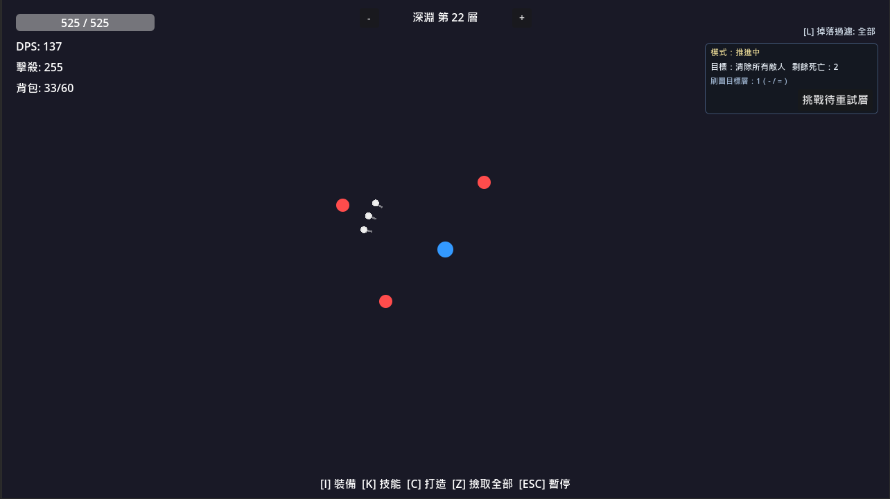
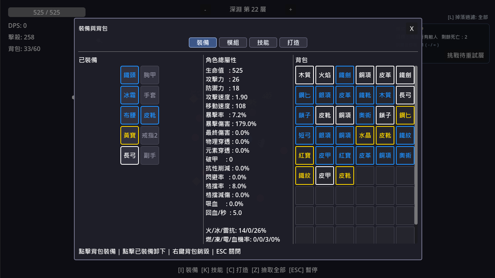

# abyssal-walker

[English](README.md) | [繁體中文](README.zh-TW.md)

`abyssal-walker` 是以 Godot 4 製作的動作 RPG 原型，核心圍繞在深淵探索、信標驅動的關卡循環，以及風險與回報的取捨。

- 在大廳準備裝備與配置
- 選擇深淵信標，或使用最低循環的 `Baseline Dive`
- 進入深淵戰鬥並推進深度
- 收集戰利品與信標
- 成功撤離後入庫，失敗則失去本場戰利品

## 遊玩預覽

  

## 截圖

  
  
  

## 目前玩法循環

1. 進入 `Lobby`
2. 從信標庫存中選擇一張 `Abyss Beacon`
3. 若沒有信標，仍可使用不消耗的 `Baseline Dive`
4. 從倉庫配置本次行動裝載
5. 進入深淵，依深度、危險值與信標詞綴推進
6. 收集掉落物與新的信標
7. 選擇撤離或繼續深入
8. 結算後返回大廳

## 核心系統

- 信標驅動的行動開局
- 深度、基礎難度與 `danger` 組成的有效難度
- 本場背包戰利品：`run_backpack_loot`
- 持久化倉庫戰利品：`stash_loot`
- 持久化倉庫材料：`stash_materials`
- 信標掉落、消耗與庫存管理
- 深淵尾王必掉信標、一般怪物低機率掉信標
- 由 `data/*.json` 驅動的內容配置

## 操作鍵位

- `I`：裝備面板
- `K`：技能面板
- `C`：Crafting 面板
- `M`：模組面板
- `Z`：拾取附近掉落
- `L`：切換掉落篩選
- `E`：確認撤離 / 確認結算返回
- `F`：在撤離視窗期間選擇繼續
- `N`：挑戰暫存失敗樓層
- `Esc`：暫停

## 主要場景

- 大廳：`scenes/main/lobby.tscn`
- 戰鬥：`scenes/main/game.tscn`

## 快速開始

1. 安裝 Godot 4.x
2. 用 Godot 開啟本專案資料夾
3. 執行專案（入口場景為 `Lobby`）

## 變更紀錄

請參考 `CHANGELOG.md`。
