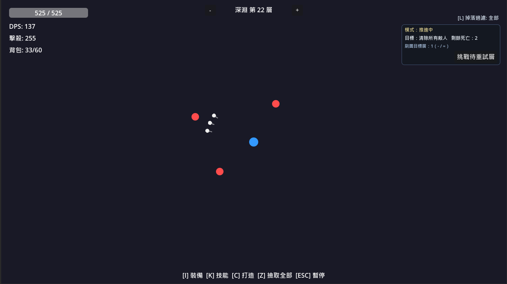
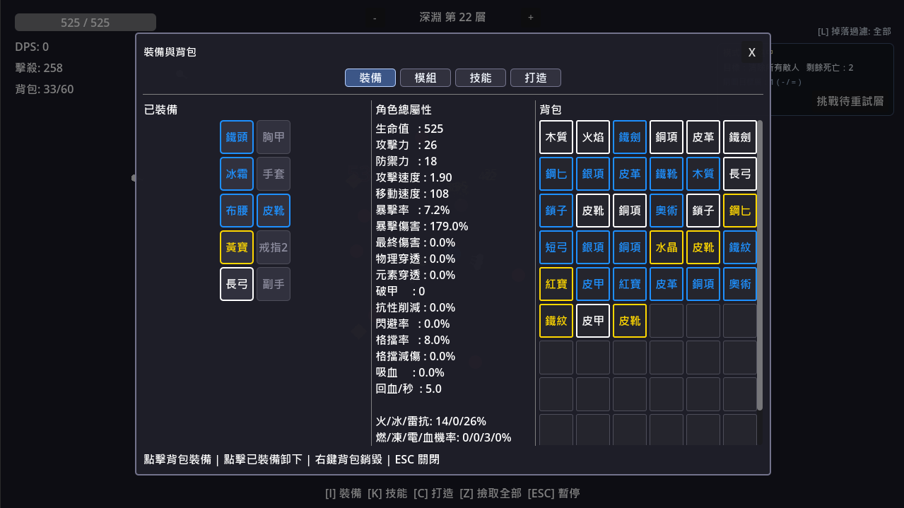
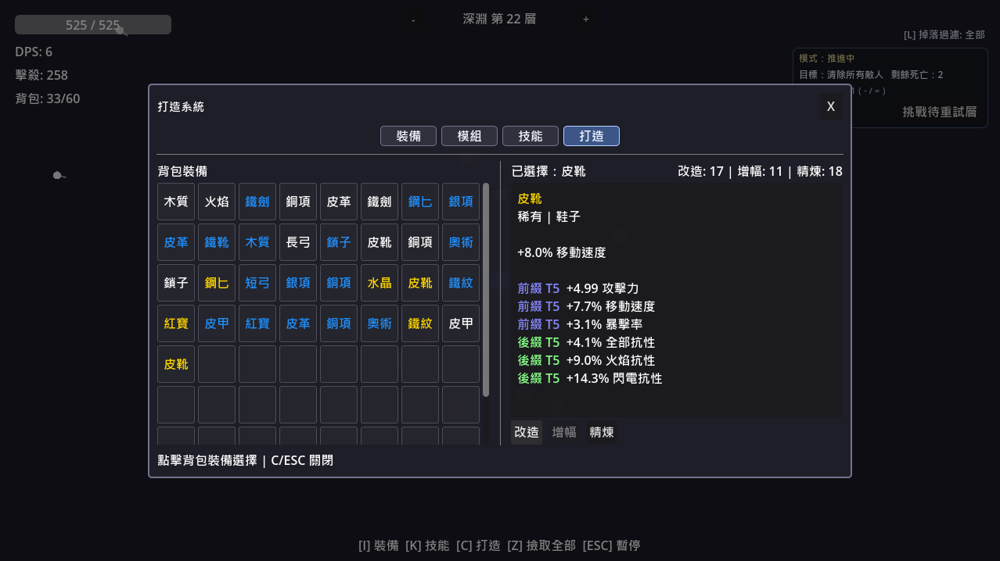

# abyssal-walker

[English](README.md) | [繁體中文](README.zh-TW.md)

`abyssal-walker` 是使用 Godot `4.6` 開發的 2D 動作 RPG 原型，核心玩法是由「深淵信標」決定探索參數，並在每次下潛中做撤離與風險取捨。

## 遊戲預覽

  

## 截圖

  
  
  

## 版本快照

- 專案名稱：`Abyssal Walker`
- 目前專案版本：`2.10.1`
- 預設進入場景：`scenes/main/lobby.tscn`
- 主要戰鬥場景：`scenes/main/game.tscn`
- 支援介面語系：`en`、`zh_TW`

## 核心玩法循環

1. 進入 `Lobby` 並準備目前 build。
2. 在倉庫與當前 build 之間移動戰利品。
3. 從庫存選擇一張 `Abyss Beacon`。
4. 若信標庫存為空，可啟動 `Baseline Dive`（不消耗信標）。
5. 開局後使用信標參數建立本次探索：
   - `base_difficulty`
   - `max_depth`
   - `lives_max`
   - `modifier_ids`
6. 推進樓層、累積 `danger`，並處理精英與 Boss 壓力。
7. 提取視窗開啟時做抉擇：
   - `[E]` 立即撤離並保住當前收益
   - `[F]` 繼續下潛換取更高風險報酬
8. 返回大廳：
   - 成功撤離會把背包戰利品轉入倉庫
   - 失敗會失去本次 run 背包戰利品

## 系統重點

### 信標驅動的 run 生成

- 啟用信標後會被消耗。
- Boss 必定至少掉落一張信標。
- 一般敵人與精英也有較低機率掉落信標。
- 有效難度使用公式：
  - `effective_level = clamp(base_difficulty + depth - 1 + danger, 1, 100)`

### Build 準備與倉庫流程

- 大廳 Build 準備支援：
  - Equipment
  - Skill Gems
  - Support Gems
  - Modules
- 提供快速裝備、倉庫/出擊配裝互轉與配裝清理流程。
- Crafting 以大廳流程為主，並消耗倉庫材料。

### 資料驅動內容

- 深淵資料表：
  - `data/abyss/floors.json`
  - `data/abyss/floor_events.json`
  - `data/abyss/beacon_modifiers.json`
  - `data/abyss/beacon_templates.json`
- 戰鬥與 build 資料表：
  - `data/enemies/enemies.json`
  - `data/enemies/elite_affixes.json`
  - `data/equipment/*.json`
  - `data/gems/*.json`
  - `data/modules/modules.json`
  - `data/affixes/*.json`

### 在地化

- 大廳可即時切換語言（`en` / `zh_TW`）。
- 在地化文字檔：
  - `data/localization/ui_en.json`
  - `data/localization/ui_zh_TW.json`

### 存檔機制

- 本機存檔流程包含：
  - 原子寫入（`.tmp` -> `.dat`）
  - 備份輪替（`.bak`）
- 存檔位置：
  - `user://saves/save_slot_1.dat`
  - `user://saves/save_slot_1.bak`

## 操作鍵位

### 戰鬥中

- `WASD` / 方向鍵：手動移動（可覆寫自動移動）
- `V`：切換自動移動
- `I`：裝備面板
- `K`：技能面板
- `M`：模組面板
- `Z`：吸取附近掉落物
- `L`：切換掉落物篩選
- `E`：確認撤離 / 確認摘要返回
- `F`：在提取視窗中選擇繼續
- `N`：挑戰待處理的失敗樓層
- `Esc`：暫停
- `Enter` / `Space`：確認摘要返回

### Debug 版本

- `F5`：手動存檔
- `F6`：手動讀檔
- `F7`：清除本機存檔

## 專案結構

- `scenes/`：主流程、UI 與戰鬥場景
- `scripts/`：Autoload、核心系統、角色與 UI 邏輯
- `data/`：JSON 遊戲資料與在地化表
- `assets/`、`resources/`：美術資源與可重用資源
- `docs/`：設計與技術文件
- `readme-assets/`：README 使用的圖片與 GIF

## 快速開始

1. 安裝 Godot `4.6`（或其他相容的 `4.x` 版本）。
2. 在 Godot 中開啟此專案資料夾。
3. 執行專案。
4. 遊戲會從大廳場景啟動。

## 延伸文件

- 信標規格：`docs/abyss-beacon-spec.md`
- 版本歷史：`CHANGELOG.md`

## 變更紀錄

請參考 `CHANGELOG.md`。
